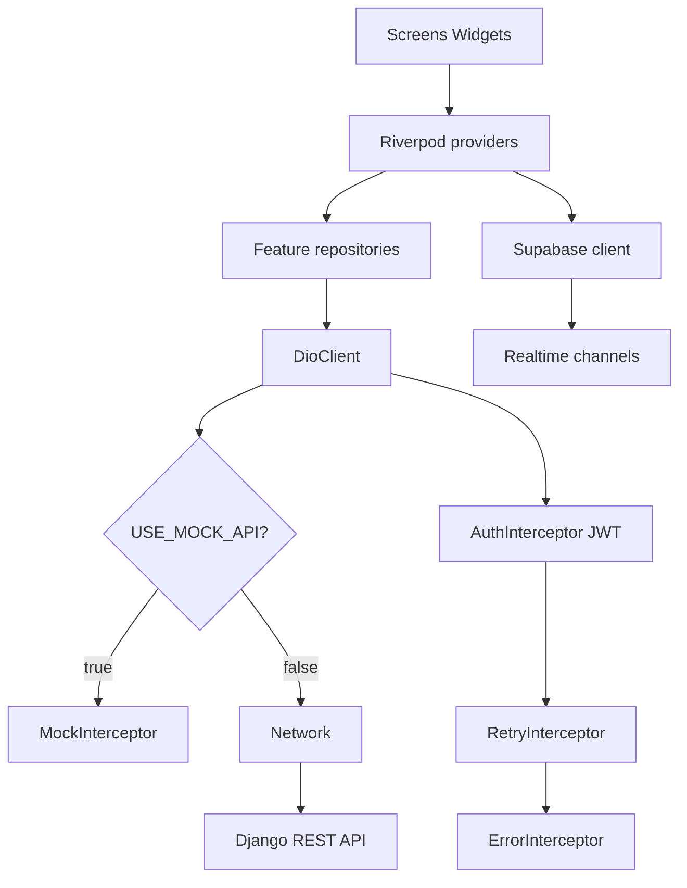
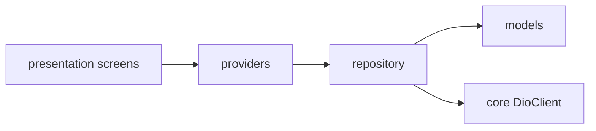
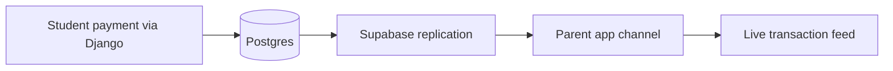

# Architecture & Design Patterns

HapoPay uses a Clean Layered Architecture organized into feature modules (`lib/features/<feature_name>/`). This limits cross-coupling and allows independent development.

## Contents

- [High-Level Overview](#high-level-overview)
- [System workflow](#system-workflow)
- [State Management — Riverpod](#state-management--riverpod)
- [Navigation — GoRouter](#navigation--gorouter)
- [Backend Integration](#backend-integration)
- [Worked Example](#worked-example)

## High-Level Overview

```
┌───────────────────────────────────────────────────────────┐
│                     Presentation Layer                     │
│    Widgets / Screens        ◄──►        Riverpod State     │
└───────────────────────────┬─────────────────────────────────┘
                             │ Ref watches / Notifier triggers
                             ▼
┌───────────────────────────────────────────────────────────┐
│                      Repository Layer                      │
│                 Business Rule Integrations                 │
└───────────────────────────┬─────────────────────────────────┘
                             │ API / SDK request maps
                             ▼
┌───────────────────────────────────────────────────────────┐
│                     Data Source Layer                      │
│       Dio HTTP Client        │      Supabase Realtime /     │
│                               │         Storage              │
└───────────────────────────────┴─────────────────────────────┘
```

Each feature module (e.g. `lib/features/student/`) implements this same three-layer split internally — model, repository, provider, presentation — so features can be developed, tested, and reasoned about in isolation.

## System workflow

### Request path (Flutter → backends)



### Auth redirect (GoRouter)

```mermaid
flowchart TD
  nav[Navigation request] --> redirect[GoRouter redirect]
  redirect --> status{AuthStatus}
  status -->|unknown| wait[Stay or splash]
  status -->|unauthenticated| login[/login]
  status -->|authenticated parent| parent[/parent]
  status -->|authenticated student| student[/student]
```

### Feature module pattern



## State Management — Riverpod

The app uses Riverpod 2.x for state management. Providers and Notifiers are annotated to generate highly-optimized code using `riverpod_generator`.

### Example: Transaction List Notifier

```dart
@riverpod
class TransactionList extends _$TransactionList {
  @override
  Future<List<Transaction>> build() async {
    final repo = ref.read(transactionRepositoryProvider);
    return repo.fetchTransactions();
  }

  Future<void> addTransaction(Transaction tx) async {
    state = const AsyncValue.loading();
    state = await AsyncValue.guard(() async {
      await ref.read(transactionRepositoryProvider).createTransaction(tx);
      return ref.read(transactionRepositoryProvider).fetchTransactions();
    });
  }
}
```

## Navigation — GoRouter

Navigation is declared globally using GoRouter. Deep-linking, route parameters, and auth-state redirection are handled within the router definition.

### Example: App Router Configuration

```dart
final appRouter = GoRouter(
  initialLocation: '/login',
  redirect: (context, state) {
    final authState = ref.read(authProvider);
    final isLoggingIn = state.matchedLocation == '/login';

    if (authState.jwtToken == null) {
      return '/login';
    }
    if (isLoggingIn) {
      return authState.userRole == Role.parent ? '/parent' : '/student';
    }
    return null;
  },
  routes: [
    GoRoute(path: '/login', builder: (_, __) => const LoginScreen()),
    GoRoute(path: '/parent', builder: (_, __) => const ParentDashboardScreen()),
    GoRoute(path: '/student', builder: (_, __) => const StudentDashboardScreen()),
  ],
);
```

Feature-scoped routes (such as `/student/rewards`) are nested under their parent route rather than declared flat, keeping route ownership aligned with feature modules.

## Backend Integration

### Django REST API
All operations involving accounting adjustments, debit authorizations, registrations, and database mutations are handled by the Django REST Framework. The Flutter client uses **Dio** to interface with these API endpoints.

### Supabase Realtime
To display live payment events, the mobile client subscribes directly to Supabase's database streaming service.

```dart
final transactionChannel = supabase
    .channel('public:transactions')
    .onPostgresChanges(
      event: PostgresChangeEvent.insert,
      schema: 'public',
      table: 'transactions',
      callback: (payload) {
        ref.invalidate(transactionListProvider);
      },
    )
    .subscribe();
```



## Worked Example

The Student Rewards System is a complete, shipped implementation of this architecture end-to-end — model, repository, provider, and presentation layers, plus routing. See [`rewards_system.md`](rewards_system.md) for a walkthrough of how the pattern above maps to real files in `lib/features/student/`, including load/claim mermaid workflows.
