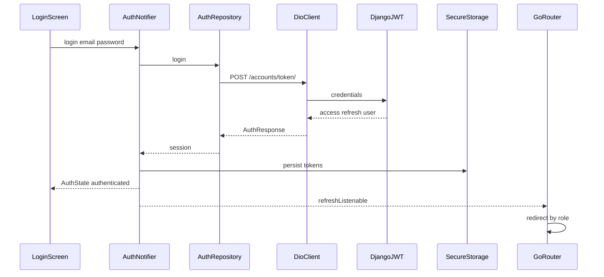
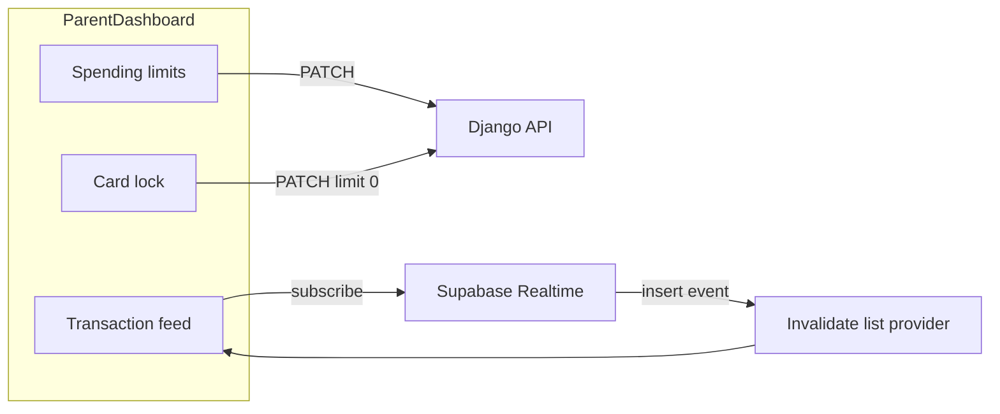
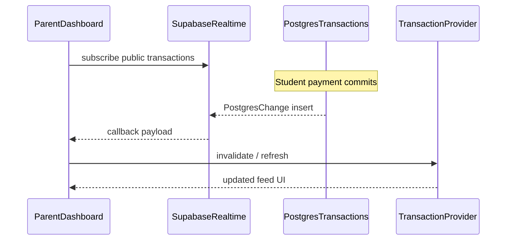

# Features & Screens

HapoPay provides a tailored experience for both parents and students.

## App map (roles & routes)

```mermaid
flowchart TD
  launch[App launch] --> restore[AuthNotifier restore session]
  restore --> gate{Authenticated?}
  gate -->|no| login[/login]
  login --> register[/register]
  gate -->|parent| parent[/parent]
  gate -->|student| student[/student]
  parent --> ledger[/parent/ledger]
  parent --> limits[/parent/limits]
  student --> rewards[/student/rewards]
  student --> payQr[/student/pay-qr]
  student --> myQr[/student/my-qr]
```

## 1. Authentication

All credential validations and registrations are completed using Django REST token paths.

- **Login Screen** — Inputs for email and password. Coordinates JWT exchanges with Django, caches tokens securely in device hardware, and syncs sessions to the local Supabase client.
- **Biometric Integration** — Option to cache credentials locally and authorize sessions using iOS FaceID or Android Fingerprint verification via `local_auth`.

### Auth workflow



## 2. Parent Dashboard

Provides primary oversight controls for the family ledger.

- **Limit Adjustments** — Slider and form inputs allowing immediate edits to a student's daily or weekly spending limits via `PATCH` requests to `/api/children/{id}/`.
- **Card Lock Switch** — Quick toggling mechanism that sets a student's limit to `$0`, suspending payment capability instantly.
- **Real-Time Transaction Feed** — Interactive transaction list displaying incoming payments from students, backed by Supabase Postgres streams.

### Parent controls & live feed





## 3. Student Dashboard

Features centered around payment executions and saving achievements.

- **QR Payment Creator** — Generates signed, dynamic QR payment markers containing expiring authorization credentials.
- **QR Payment Scanner** — Camera viewport powered by `mobile_scanner` that enables payment processing at merchant portals.
- **Gamified Rewards Tracker** — Visual progress tracking for milestone achievements, linking to the `/api/rewards/` Django route. See [`rewards_system.md`](rewards_system.md) for tiers, claim flow, and catalog details.

### QR pay workflow

```mermaid
flowchart TD
  dash[StudentDashboard] --> choose{Pay or show QR?}
  choose -->|pay| scan[/student/pay-qr]
  choose -->|receive| show[/student/my-qr]
  scan --> camera[mobile_scanner]
  camera --> payload[Parse QR payload]
  payload --> process[POST /payments/process/]
  process --> ledger[Balance and ledger update]
  show --> gen[Generate signed QR]
  gen --> display[Display QR on screen]
```

### Rewards entry points

```mermaid
flowchart LR
  dash[StudentDashboard] --> card[Rewards summary card]
  card -->|tap| screen[/student/rewards]
  screen --> claim[Claim achievement]
  claim --> api[POST /rewards/id/claim/]
```

Full rewards diagrams (load, claim, tiers): [`rewards_system.md`](rewards_system.md#workflows).
