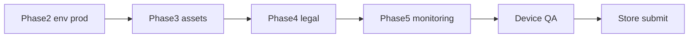

# Production Next Steps — HapoPay Flutter

Ordered runbook to ship v1.0.0 to App Store and Google Play.
See also [`PRODUCTION_READINESS.md`](../PRODUCTION_READINESS.md) for the full checklist status.

---

## Phase 1 — Identity & signing

### Android (wired in app)
- [x] `applicationId` / `namespace` → `com.hapopay.hapoPay`
- [x] Release signing loads `android/key.properties` + upload keystore
- [ ] Confirm `android/key.properties` and `android/keys/upload-keystore.jks` exist locally (gitignored)
- [ ] Verify release AAB:

```bash
flutter build appbundle --release --dart-define-from-file=.env.prod
```

### iOS (owner)
- [ ] Apple Developer Program enrollment
- [ ] App ID / bundle ID: `com.hapopay.hapoPay` (already set in Xcode project)
- [ ] Distribution certificate + provisioning profile
- [ ] Set `DEVELOPMENT_TEAM` in Xcode
- [ ] Verify: `flutter build ipa --release --dart-define-from-file=.env.prod`

---

## Phase 2 — Production environment

Create `.env.prod` (never commit):

```
SUPABASE_URL=https://your-prod.supabase.co
SUPABASE_ANON_KEY=your-prod-anon-key
API_BASE_URL=https://api.yourdomain.com/api
USE_MOCK_API=false
```

- [ ] Fill real prod values
- [ ] Confirm Django `CORS` / `ALLOWED_HOSTS` include store / web domains
- [ ] Confirm Supabase realtime replication for prod tables
- [ ] Local / CI release builds must **not** set `USE_MOCK_API=true`

Dev / mock UI:

```bash
flutter run --dart-define-from-file=.env.dev
# .env.dev should include USE_MOCK_API=true
```

---

## Phase 3 — Store assets

- [ ] Branded Android adaptive icons + iOS AppIcon (1024×1024 source)
- [ ] Splash / launch screens (Android `launch_background.xml`, iOS LaunchScreen)
- [ ] Play Store feature graphic (1024×500)
- [ ] App Store screenshots (6.7", 6.5", 5.5", iPad Pro)
- [ ] Replace `.gitkeep` placeholders under `assets/images/` and `assets/icons/`

---

## Phase 4 — Legal & store listings

- [ ] Host Privacy Policy URL (required by both stores)
- [ ] Host Terms of Service
- [ ] Short + long store descriptions, keywords
- [ ] Content rating / age rating questionnaires
- [ ] Play Console Data safety form
- [ ] App Store Connect: pricing, category, age rating

---

## Phase 5 — Monitoring & release CI

- [ ] Integrate Sentry or Firebase Crashlytics
- [ ] Add GitHub Actions jobs for release AAB / IPA with `.env.prod`
- [ ] Version bump automation (`pubspec.yaml` version + build number)

---

## Phase 6 — Device QA checklist



Run on physical devices before submission:

- [ ] Login / register / biometric unlock
- [ ] Parent: spending limits, card lock, live feed
- [ ] Student: QR pay / scan flow
- [ ] Rewards: tier ladder, streak panel, claim achievement (light + dark)
- [ ] Offline / error snackbars behave; no mock interceptor in release
- [ ] `flutter analyze` clean; test suite green

---

## Backend parity (rewards)

Django `/api/rewards/` should match the client catalog in
`lib/features/student/models/rewards_catalog.dart`:

| Tier | Points |
|------|--------|
| Bronze | 0–149 |
| Silver | 150–499 |
| Gold | 500–999 |
| Platinum | 1000+ |

Achievement IDs: `first_pay`, `qr_rookie`, `qr_pro`, `campus_champ`,
`budget_3`, `week_warrior`, `month_master`, `smart_spender`, `big_buffer`.

---

## Secrets hygiene

Never commit: `key.properties`, `*.jks`, `.env.prod`, `.env.dev`, provisioning profiles.
Keep `.env.example` as the only committed env template.
