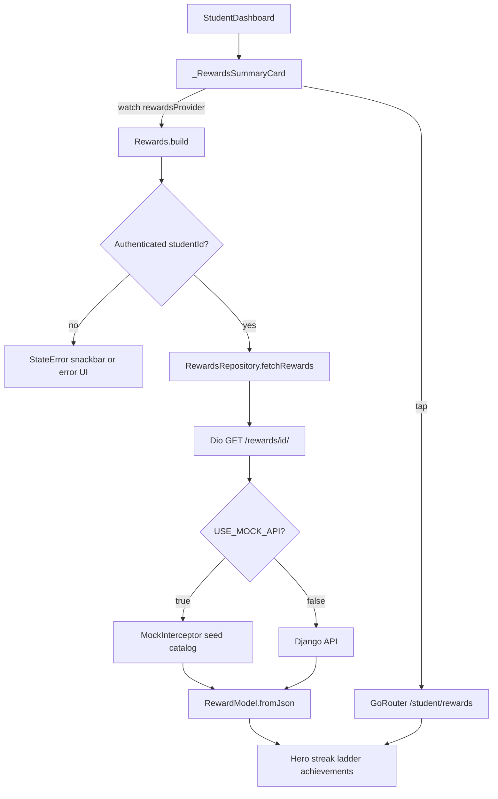
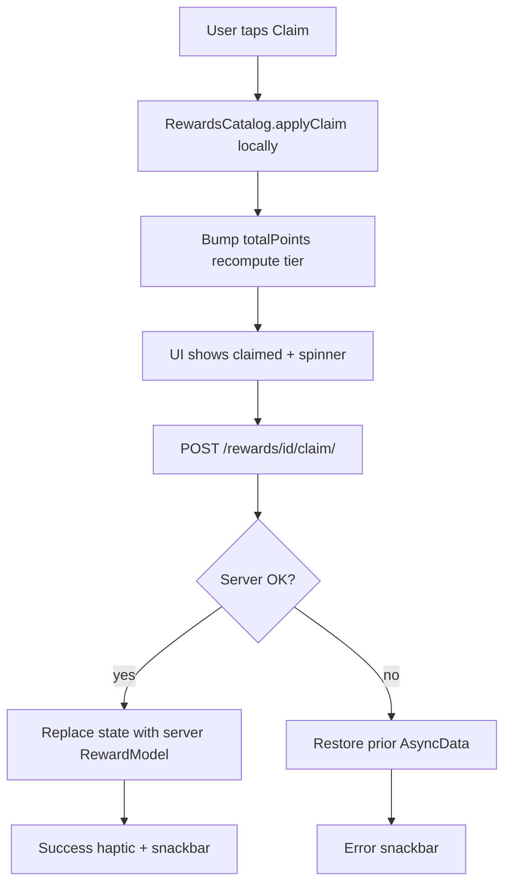
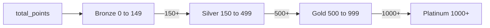
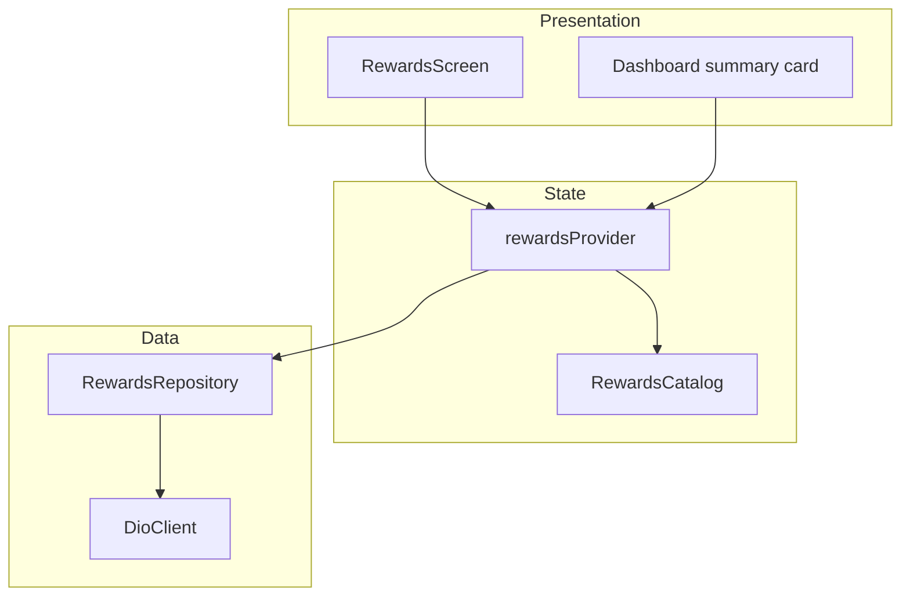

# HapoPay Student Rewards System

> Implements the layered pattern described in [`ARCHITECTURE.md`](ARCHITECTURE.md); tracked under Milestone 3 in [`NEXT_STEPS.md`](NEXT_STEPS.md).

## Overview
Gamified student rewards: tier progress, streak panel, claimable achievements, and a dashboard summary card. Content and thresholds live in a shared catalog so mock, demo, and UI stay aligned.

## Status
**Client complete** for the redesigned catalog and claim UX. Earning rules are owned by the Django `/api/rewards/` backend; the Flutter app displays state and claims achievements.

## Workflows

### Load rewards (dashboard → full screen)



### Claim achievement (optimistic)



### Tier progression (points → badge)



### Feature data path



## Game design

### Tiers
| Tier | Points |
|------|--------|
| Bronze | 0–149 |
| Silver | 150–499 |
| Gold | 500–999 |
| Platinum | 1000+ |

### Achievements
| ID | Name | Points | Category |
|----|------|--------|----------|
| `first_pay` | First Tap | 25 | Payments |
| `qr_rookie` | QR Rookie | 50 | Payments |
| `qr_pro` | QR Pro | 100 | Payments |
| `campus_champ` | Campus Champ | 200 | Payments |
| `budget_3` | Budget Buddy | 75 | Streak |
| `week_warrior` | Week Warrior | 150 | Streak |
| `month_master` | Month Master | 300 | Streak |
| `smart_spender` | Smart Spender | 100 | Saving |
| `big_buffer` | Big Buffer | 125 | Saving |

Streak milestones shown in UI: 3 / 7 / 14 / 30 days (derived from `streak_days`).

Source of truth: `lib/features/student/models/rewards_catalog.dart`.

## Architecture

- **Catalog**: `rewards_catalog.dart` — tier milestones + achievement definitions + seed helpers
- **Model**: `reward_model.dart` — `RewardTier`, `AchievementModel`, `MilestoneModel`, `RewardModel`
- **Repository**: `rewards_repository.dart` — `GET /rewards/{id}/`, `POST /rewards/{id}/claim/`
- **Provider**: `rewards_provider.dart` — optimistic claim (points + tier), rollback on failure without full-screen error wipe
- **UI**: `rewards_screen.dart` (hero, streak panel, tier ladder with ranges, achievement grid); dashboard `_RewardsSummaryCard`
- **Routing**: `/student/rewards`
- **Mock**: `MockInterceptor` only when `USE_MOCK_API=true` (see [`EnvConfig`](../lib/core/config/env_config.dart))

## API contract

```
GET  /api/rewards/{studentId}/
POST /api/rewards/{studentId}/claim/   body: { "achievement_id": "..." }
```

Response is a full `RewardModel` JSON (`snake_case`). `next_milestone_points` is the **absolute** next-tier threshold (not remaining points).

## Local mock / demo

```bash
# Enable in-memory mock API (includes rewards seed)
flutter run --dart-define-from-file=.env.dev
# .env.dev must set USE_MOCK_API=true
```

`RewardModel.demo()` builds from `RewardsCatalog` for tests and offline fixtures. It is **not** an automatic network fallback — failed fetches surface as provider errors / snackbars.

## How to test
1. Sign in as a student with mock API enabled (or a backend matching the catalog).
2. Open the Rewards summary on the student dashboard → full Rewards screen.
3. Confirm tier ranges, streak week dots, and milestone checks.
4. Claim an earned unclaimed achievement; points and tier should update.
5. Repeat in light and dark themes.
